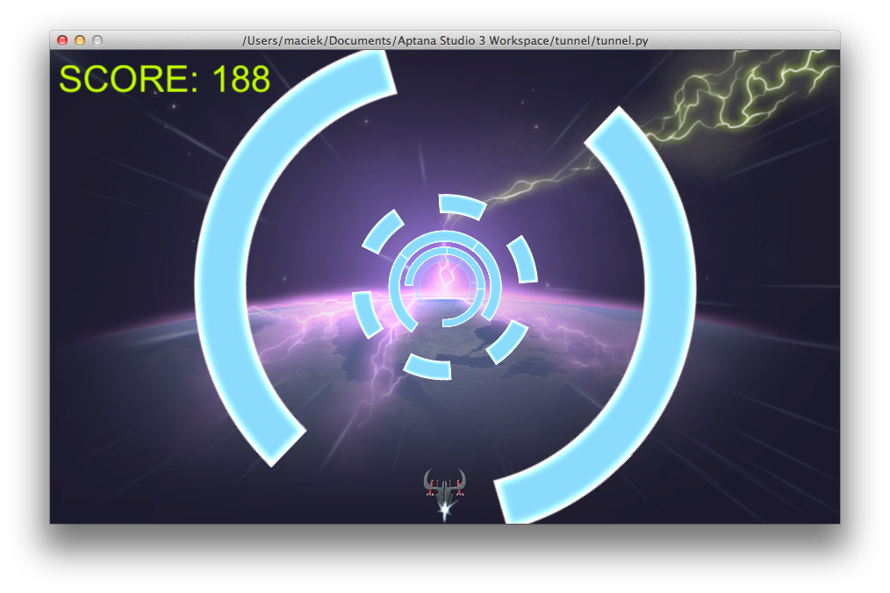

revhex
=========



**Reverse Hexagon** is a game heavily inspired by Super Hexagon on iOS, which managed to steal big chunk of my free time :) I created for company hackathon just for fun, using Python and Cocos2D library.

It was my first approach at Cocos2D, and one of the goals of this project was to check how well Python/Cocos2D combo would be for creating quick prototypes.

Graphics was created by my friend Przemysław Piekarski, as a last minute favor just before presenting it to everyone :) Thanks a lot!

To get Cocos2D
```
easy_install cocos2d
```
should be enough :)

As of now, for reasons I didn't bother investigating, Cocos2D does not run with 64-bit Python on MacOS X. To get the game to run, type following command in the terminal:
```
defaults write com.apple.versioner.python Prefer-32-Bit -bool yes
```

